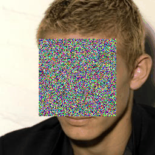
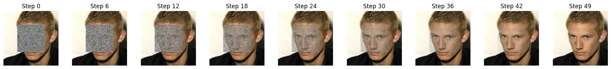

# Flow-Matching-Inpainting
Flow-Matching Inpainting is a diffusion-inspired generative approach designed for image inpainting tasks. Unlike traditional diffusion models that sample via stochastic reverse processes, this method learns a deterministic flow field that maps corrupted images directly to the ground truth, conditioned on a mask. The model is trained to predict the "flow" between different time steps, allowing efficient sampling with simple numerical solvers such as Euler integration.

By conditioning on the visible regions and learning how to gradually refine the masked parts over time, the model reconstructs missing regions in a smooth and coherent manner—preserving both semantic structure and fine textures. This enables high-quality, visually consistent inpainting results, even under complex or large-area corruptions.

## Result
| Input Image                                                               | Reconstructed Image                                                                        |
|----------------------------------------------------------------------------|--------------------------------------------------------------------------------------------|
|  |  |

| Reconstructing Progress                                                     |
|----------------------------------------------------------------------------|
|  |
